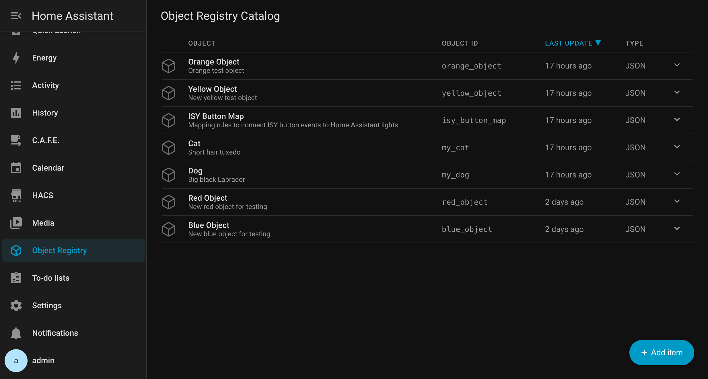
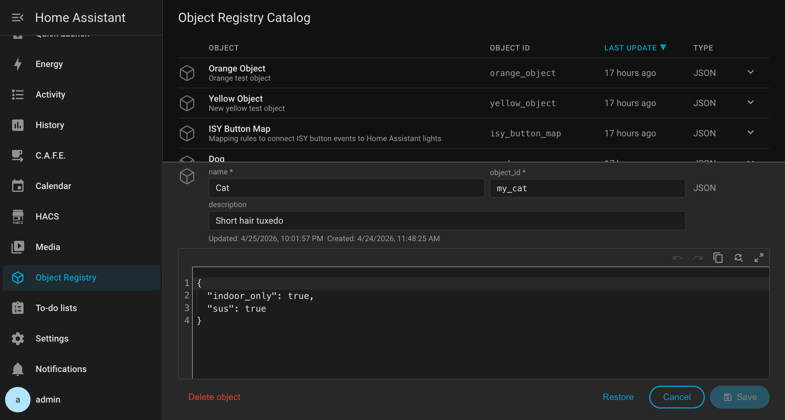
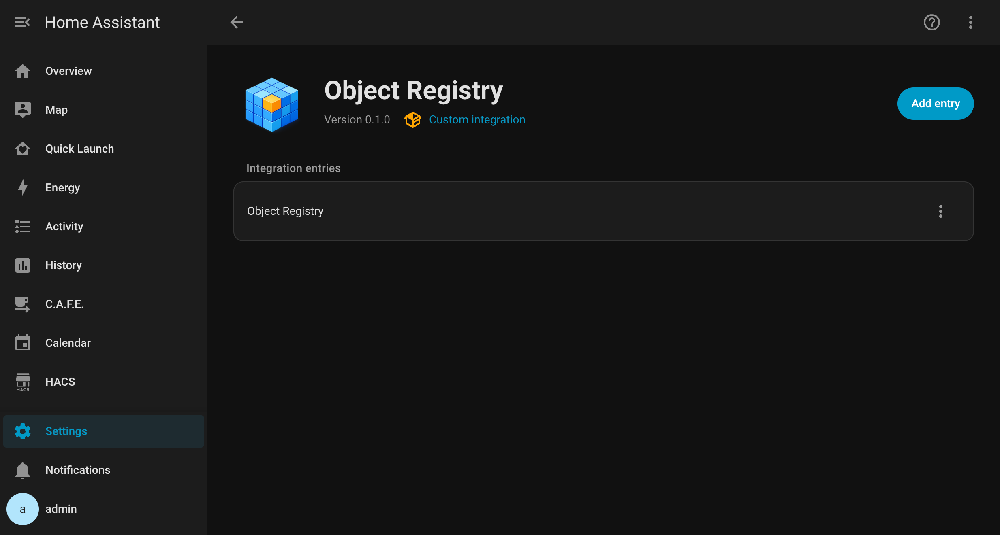

# Object Registry Integration for Home Assistant

**Object Registry** is an integration for Home Assistant which provides a named,
in-memory JSON object store accessible from any automation or script.
Define your mapping or config data once, reuse it anywhere.


_(Object list view)_

## What It Does

Home Assistant has transformed what I can do in my home environment which has
a complex mix of heterogeneous, "modern" (walled-garden) devices plus a lot of legacy automation tech.
The only integration I didn't find was an easy tool to create and manage
configuration-style structured data for use in automations and scripts.
Think mapping tables, lookup references, and device relationships,
but without working directly with the file system or embedding it
in automation YAML.

**A concrete example:** An ISY/Eisy controller manages a fleet of legacy Insteon and Z-Wave
devices pretty well, especially Insteon native table links. However, wiring up five different ISY remote button
event types to Hue, fan, pool, door openers, and more
needs an easy to edit relationship mapping layer. Without a registry, that mapping is hardcoded across
automations and prone to breakage. With Object Registry, YAML service calls retrieve named
native mapping objects to make automations easier to manage and more reusable.

### Capabilities

- **In-memory object store** — named JSON objects accessible from automations and
  scripts via `object_registry.get_item`, `get_object`, and `list_items`
- **Native HA panel** — full management UI in the sidebar, no file editing required
- **Real-time live updates** — the panel list updates instantly when any object
  changes, even from another browser window
- **Concurrent edit detection** — amber warning banner appears if another user
  saves a change to the object you are editing
- **Validation** — snake_case object IDs, unique names (case-insensitive),
  valid JSON enforced on save
- **Rename safety** — renaming an object_id triggers a confirmation warning that
  existing automations may break
- **Persistent storage** — objects survive HA restarts via HA's native Store
  interface
- **HACS-ready** — structured for easy community installation

<br/>


_Object edit view_

## Installation

> Not yet available in HACS default store, but I'm working on it. Manual installation only for now.

### Manual via HACS (custom repository)

1. In HACS → Integrations → ⋮ → Custom repositories
2. Add `https://github.com/ferventgeek/ha-object-registry` as an Integration
3. Install **Object Registry**
4. Restart Home Assistant
5. Go to Settings → Integrations → Add Integration → **Object Registry**

### Manual

1. Copy `custom_components/object_registry/` into your HA `config/custom_components/` directory
2. Restart Home Assistant
3. Go to Settings → Integrations → Add Integration → **Object Registry**

## Usage

Once installed, **Object Registry** appears in the sidebar. Use the panel to
create and manage objects.

### Service calls

Use objects in automations and scripts via three service calls:

**Get just the data payload** — returns only the JSON you stored, ready to use
directly in templates. This is what most automations need:

```yaml
action: object_registry.get_item
data:
  object_id: isy_button_map
response_variable: result
# result.data contains your JSON payload as an object accessible via dot notation
```

**Get the full object including metadata** — returns the payload plus `uuid`,
`name`, `description`, `created`, `updated`, and `type`:

```yaml
action: object_registry.get_object
data:
  object_id: isy_button_map
response_variable: result
# result.data contains your object including its internal metadata
# like it's uuid, date created, date updated, etc.
```

**List all objects (metadata only, no payload):**

```yaml
action: object_registry.list_items
response_variable: result
```

More HA YAML examples coming based on community feedback.

## Requirements

- Home Assistant 2026.4 or later
- No external dependencies

## Development

This project was built using a design-doc-first methodology with AI assistance.
See [`docs/`](docs/) for full architecture, design philosophy, and specification
documents. In past projects I've been _selective_ about commit visibility but in
this case you'll find the full, verbose change history and commit messages
in case you're curious about how it came together using a design-driven approach with
Claude doing the bulk of the code at my direction.

I'm increasingly convinced
AI is the renaissance of a Balrog skill from the agile before-times: SDD (SRD, and SDS).
Before writing a single line of code, invest first in formal research, design, and documentation
so the AI knows what the vision and contract goals are. Bottom-up, iterative AI
can snowball small hallucinations and false confidence into a tangled mess that's hard
to comprehend and debug. Design-driven, top-down seems to produce better outcomes.

The code is intentionally written for readability. I've tried to keep the code
understandable by casual coders like me without external references. No build
step, no external dependencies, no advanced patterns. There is a bit more hair
in some of the JavaScript and CSS in the panel code than I'd like, but I'm more
of an automation and backend nerd. UI is necessary evil not passion for me.

## Gratitude

I am incredibly grateful to the Home Assistant developer community. It's the quality
of their documentation, open-source frontend code, and the generosity of
developers sharing patterns and answering questions made this project possible.
This is my first HA integration and I could not have gotten this far without the
foundation the community has built. Thank you so much!

> [!TIP]
> I can't wait to see how you'll use the Object Registry- please share your examples and suggestions.

## License

MIT — see [LICENSE](LICENSE)

<br/>


_(Integration page view)_
